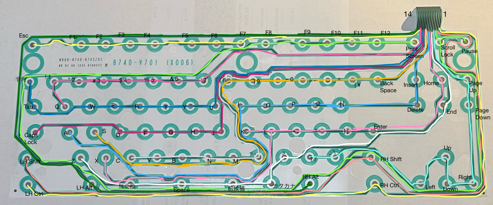
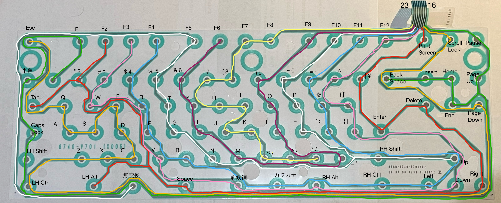

# Sega Saturn Keyboard (HSS-0129)
The Sega Saturn Keyboard is an 89 key keyboard released for the Sega Saturn console.  It connects via the standard 9-pin Saturn controller and allowed you to use the Internet (in combination with the modem & mouse), program in Saturn BASIC (in combination with the floppy disc drive) and play Typing Of The Dead. 

I thought it might be interesting to reproduce it. 

## Background Analysis
Some excellent analysis has been done already on the Saturn's controller protocol:
- [Saturn Controller Protocol MK80117 and Emulation](https://nfggames.com/forum2/index.php?topic=5055.0)
- [Saturn keyboard scan codes](https://plutiedev.com/saturn-keyboard#scancodes)
- [Evolution of Sega's controllers](https://hackaday.io/project/170365-blueretro/log/180790-evolution-of-segas-io-interface-from-sg-1000-to-saturn#)

## Keyboard Matrix
I dismantled my keyboard and figured out the keyboard matrix - it uses two thin film sheets to register key presses. 

The matrix has 14 rows and 8 columns (by my reckoning) and connects to a small controller board internally via a 23-way connector (CN2, pin 15 is not use).  The columns have a pull-up resistor so I assume the rows are scanned and the columns are read. 

|  |COLUMN 0|COLUMN 1|COLUMN 2|COLUMN 3|COLUMN 4|COLUMN 5|COLUMN 6|COLUMN 7|
|---|--------|--------|--------|--------|--------|--------|--------|--------|
|ROW 0||LH CTRL|||RH CTRL||||
|ROW 1|LH SHIFT|||||RH SHIFT|||
|ROW 2|PAUSE|SCROLL LOCK|PRINT SCREEN|F12|F11|F10|F9|F8|
|ROW 3|PAGE UP|PAGE DOWN|RIGHT|DOWN|LEFT|UP|_ \ |? /|
|ROW 4|END|Z|SPACE|前候補|カタカナ|無変換||> .|
|ROW 5|HOME|X|ENTER|} ]|* :|+ ;|L|K|
|ROW 6|INSERT|A|DELETE|{ [|' @|P|O|I|
|ROW 7|BACKSPACE|S|\| ¥|_ ^|= -|- 0|) 9|( 8|
|ROW 8||C||V|B|N|M|< ,|
|ROW 9|CAPS LOCK|D|||F|G|H|J|
|ROW 10|半角/全角|E|TAB|W|RH CTRL|T|Y|U|
|ROW 11|! 1|Q|“ 2|# 3|$ 4|% 5|& 6|' 7|
|ROW 12|F1|ESC|F2|F3|F4|F5|F6|F7|
|ROW 13|||LH ALT|RH ALT|||||

## Controller
The keyboard has an internal controller board based around the Motorola MC68HC05C4 microcontroller.  This 8-bit MCU has about 4KB of internal ROM.  

The controller board connects to the Saturn via its 9-pin controller port which uses a 4-bit protocol to communicate.  Interestingly the internal pinout this connector (CN1) doesn't match the controller's pinout.  Weird.  The signals are all pulled up. 

| Controller | CN1      |
|------------|----------|
| 1 (+5V)    | 9        |
| 2 (Data 1) | 3        |
| 3 (Data 0) | 4        |
| 4 (REQ)    | 5        |
| 5 (SEL)    | 8        |
| 6 (ACK)    | 7        |
| 7 (Data 3) | 1        |
| 8 (Data 2) | 2        |
| 9 (GND)    | 6        |

## Keys
This Japanese keyboard has some additional keys with Kanji labels.  Here's a quick, rough translation - they are all related to entry of Japanese or Roman characters. 

| Japanese | English |
|----------|---------|
| 半角/全角 | Half-width/Full-width |
| 英数 | Alphanumeric |
| 漢字番号 | Kanji Number |
| 無変換 | No Conversion |
| 前候補 | Previous Candidate |
| 無変換(次候補) | No Conversion (Next Cadidate) |
| 全候補 | All Candidates |
| 漢字 | Kanji |
| カタカナ | Katakana |
| ひらがな | Hiragana |
| ローマ字 | Roman Characters |

